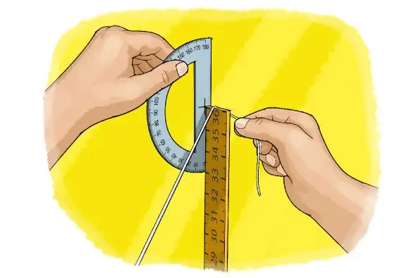

Hello friends, Today we are going to learn how to measure the circumference of the earth based on the appearance of shadow.

 

 The earth is massive, but you don't need a massive ruler to measure its size. All you need are a few household items--and little bit of geometry!  Credit: George Retseck
 

## Key concepts
1. Mathematics
2. Geometry
3. [Circumference](https://en.wikipedia.org/wiki/Circumference)
4. Angles
5. [Earth's equator](https://www.nationalgeographic.org/encyclopedia/equator/#:~:text=An%20equator%20is%20an%20imaginary,is%20widest%20at%20its%20Equator.)

## Introduction

If you wanted to measure the circumference of Earth, how long would your tape measure have to be? Would you need to walk the whole way around the world to find the answer? Do you think you can do it with just a meterstick in one location? Try this project to find out!
  
Before you begin, however, it is important to note this project will only work within about two weeks of either the spring or fall equinoxes (usually around March 20 and September 23, respectively).
 

## Background  

What is Earth’s circumference? In the [age of modern technology](https://historyoftechnologyif.weebly.com/information-age.html) this may seem like an easy question for scientists to answer with tools such as [satellites](https://www.space.com/24839-satellites.html) and [GPS](https://www.sciencedirect.com/topics/earth-and-planetary-sciences/global-positioning-system)—and it would be even easier for you to look up the answer online. It might seem like it would be impossible for you to measure the circumference of our planet using only a meterstick. The Greek mathematician [Eratosthenes](https://www.famousscientists.org/eratosthenes/), however, was able to estimate Earth’s circumference more than 2,000 years ago, without the aid of any modern technology. How? He used a little knowledge about geometry!
  
At the time [Eratosthenes](https://www.famousscientists.org/eratosthenes/) was in the city of Alexandria in Egypt. He read that in a city named Syene south of Alexandria, on a particular day of the year at noon, the sun’s reflection was visible at the bottom of a deep well. This meant the sun had to be directly overhead. (Another way to think about this is that perfectly vertical objects would cast no shadow.) On that same day in Alexandria a vertical object did cast a shadow. Using geometry, he calculated the circumference of Earth based on a few things that he knew (and one he didn’t):

* He knew there are 360 degrees in a circle.
* He could measure the angle of the shadow cast by a tall object in [Alexandria](https://en.wikipedia.org/wiki/Alexandria).
* He knew the overland distance between Alexandria and [Syene](https://www.thefreedictionary.com/Syene). (The two cities were close enough that the distance could be measured on foot.)
* The only unknown in the equation is the circumference of Earth!

The resulting equation was:
  
<code>Angle of shadow in Alexandria / 360 degrees = Distance between Alexandria and Syene / Circumference of Earth</code>
  
In this project you will do this calculation yourself by measuring the angle formed by a meterstick’s shadow at your location. You will need to do the test near the fall or spring equinoxes, when the sun is directly overhead at Earth's equator. Then you can look up the distance between your city and the equator and use the same equation [Eratosthenes]() used to calculate Earth’s circumference. How close do you think your result will be to the “real” value?
  
There is a geometric rule about the angles formed by a line that intersects two parallel lines. Eratosthenes assumed the sun was far enough away from our planet that its rays were effectively parallel when they arrived at Earth. This told him the angle of the shadow he measured in Alexandria was equal to the angle between Alexandria and Syene, measured at Earth’s center. If this sounds confusing, don’t worry! It is much easier to visualize with a picture. See the references in the “More to explore” section for some helpful diagrams and a more detailed explanation of the geometry involved.
  

## Materials

* Sunny day on or near the [spring](https://en.wikipedia.org/wiki/Spring_(season)) or [fall equinoxes](https://en.wikipedia.org/wiki/Equinox) (about March 20 or September 23, respectively)
* Flat, level ground that will be in direct sunlight around noon
* Meterstick
* Volunteer to help hold the meterstick while you take measurements (Or, if you are doing the test alone, you can use a bucket of sand or dirt to insert one end of the meter stick to hold it upright.)
* Stick or rock to mark the location of the shadow
* Calculator
* Protractor
* Long piece of string
* Optional: plumb bob (you can make one by tying a small weight to the end of a string) or post level to make sure the meter stick is vertical

## Preparation
<ul>
<li>Look at your local weather forecast a few days in advance and pick a day where it looks like it will be mostly sunny around noon. (You have a window of several weeks to do this project, so don’t get discouraged if it turns out to be cloudy! You can try again.)</li>
<li>Look up the sunrise and sunset times for that day in your local newspaper or on a calendar, weather or astronomy Web site. You will need to calculate “solar noon,” the time exactly halfway between sunrise and sunset, which is when the sun will be directly overhead. This will probably not be exactly 12 o’clock noon.</li>
<li>Go outside and set up for your materials about 10 minutes before solar noon so you have everything ready.</li>
</ul>

## Procedure

<ul>
<li>Set up your meter stick vertically, outside in a sunny spot just before solar noon.</li>
<li>If you have a volunteer to help, have them hold the meterstick. Otherwise, bury one end of the meterstick in a bucket of sand or dirt so it stays upright.</li>
<li>If you have a post level or plumb bob, use it to make sure the meterstick is perfectly vertical. Otherwise, do your best to eyeball it.
</li>
<li>At solar noon, mark the end of the meterstick's shadow on the ground with a stick or a rock.</li>
<li>Draw an imaginary line between the top of the meterstick and the tip of its shadow. Your goal is to measure the angle between this line and the meterstick. Have your volunteer stretch a piece of string between the top of the meterstick and the end of its shadow.</li>
<li>Use a protractor to measure the angle between the string and the meterstick in degrees. Write this angle down.</li>
<li>Look up the distance between your city and the equator.</li>
<li>Calculate the circumference of the Earth using this equation:</li>
 
<code>Circumference = 360 x distance between your city and the equator / angle of shadow that you measured</code>  
</ul>
<ul>
<li><em>What value do you get? How close is your answer to the true circumference of Earth (see “Observations and results” section)?</em></li>
<li><strong>Extra:</strong> Try repeating your test on different days before, on and after the equinox; or at different times before, at and after solar noon.<em>How much does the accuracy of your answer change?</em></li>
<li><strong>Extra:</strong>Ask a friend or family member in a different city to try the test on the same day and compare your results. <em>Do you get the same answer?</em></li>
</ul>

## Observations and results

In 200 B.C. Eratosthenes estimated Earth’s circumference at about 46,250 kilometers (28,735 miles). Today we know our planet's circumference is roughly 40,000 kilometers (24,850 miles). Not bad for a more than 2,000-year-old estimate made with no modern technology! Depending on the error in your measurements—such as the exact day and time you did the test, how accurately you were able to measure the angle or length of the shadow and how accurately you measured the distance between your city and the equator—you should be able to calculate a value fairly close to 40,000 kilometers (within a few hundred or maybe a few thousand). All without leaving your own backyard!
  

#### For more, explore:

[Calculating the Circumference of the Earth](https://www.sciencebuddies.org/science-fair-projects/project-ideas/Astro_p018/astronomy/calculating-the-circumference-of-the-earth), from Science Buddies.