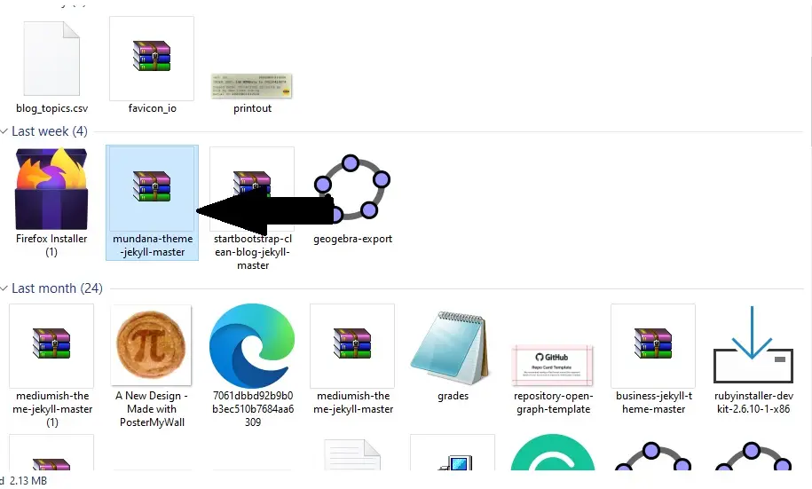
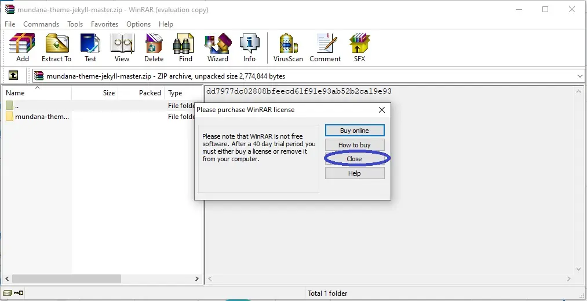
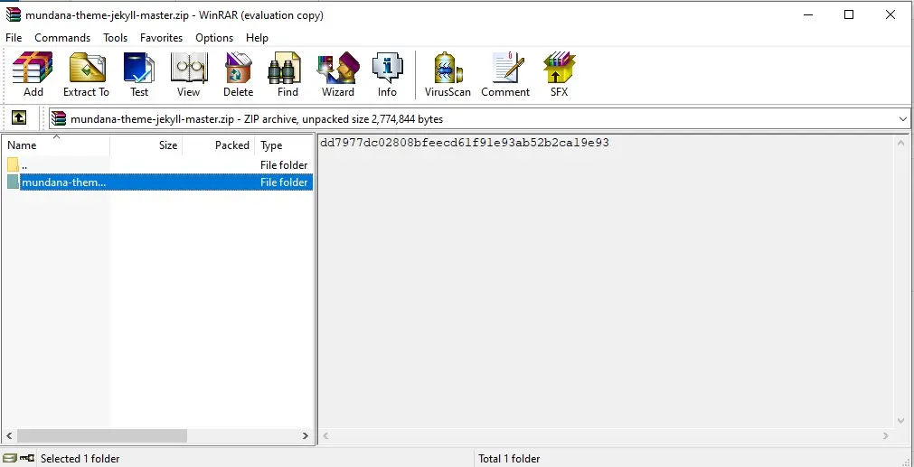
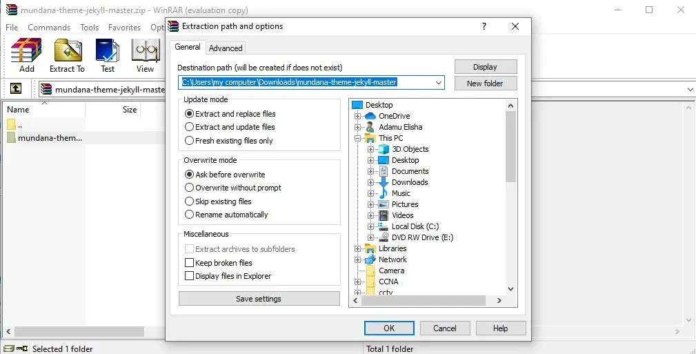
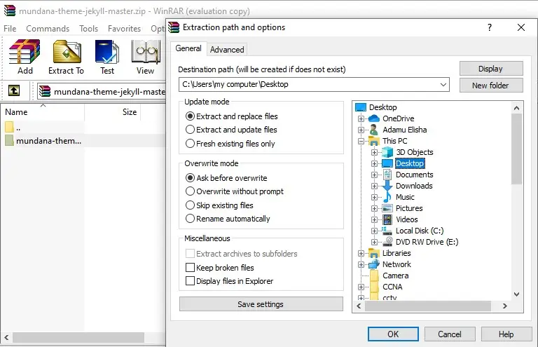
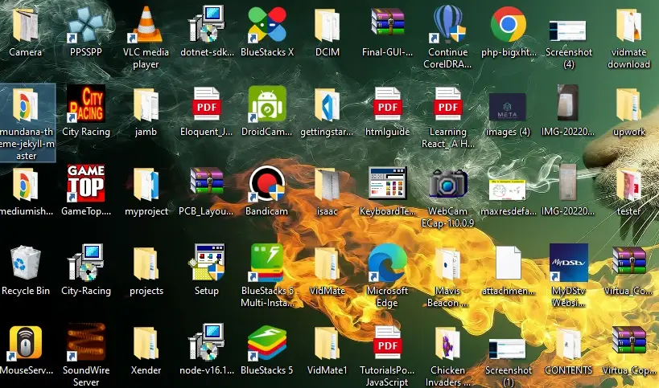

In this tutorial, we are going to give 7 steps on how to extract a ZIP file and save the content(s) in your laptop.

To do this, readers are adviced to follow carefully the steps needed to extract and save the file(s)
## 1. Find the zip file
To extract the file inside the zip file, we first explore the location of the zip within our pc.
!

## 2. Open the zip file
After locating the zip, click on `enter` on the keyboard to open the zip file.
## 3. Close the popped up options
After opening the zip file, there will be a popped up option, click on the close button.
.
## 4. Select file(s)
Select the file(s) you want to extract in the zip file.

## 5. Extract the zip content
Click on `extract to`, to extract the file, a select option will appear on the right side of the screen.

# 6. Select file location
After clicking on `extract to`, select the location you want your file.
Choose a location and click on the `OK` button to save the file.
For the picture below, `desktop` was selected.

# 7. Locate the file
You can now locate the file in the desktop.
>Note: You can save the file anywhere in your pc.
