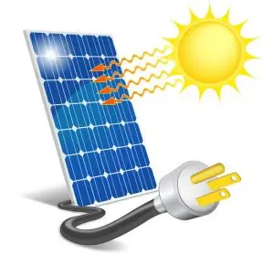
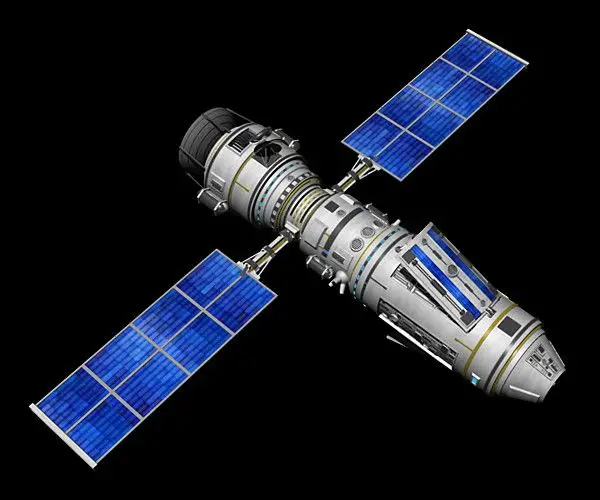
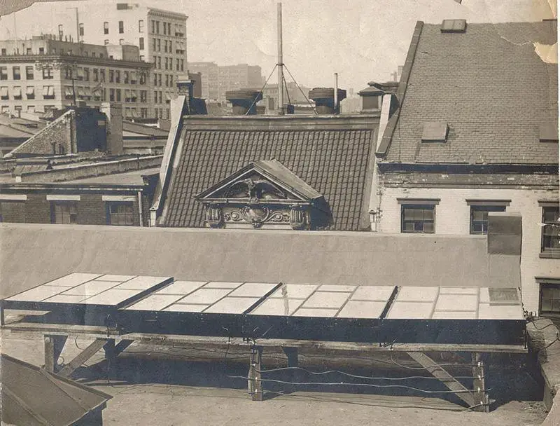
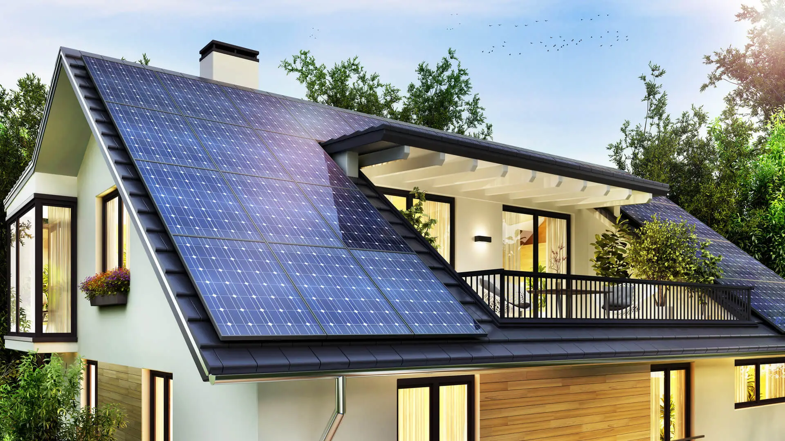

Solar panels as we have heard of is simply a bluish electronic device that collects [photons](https://www.thoughtco.com/what-is-a-photon-definition-and-properties-2699039) from the sun and converts it into [electrical energy](https://byjus.com/physics/electrical-energy-and-power/).

Today we are going to break down 5 fun facts about [solar energy](https://www.energy.gov/eere/solar/how-does-solar-work#:~:text=Solar%20technologies%20convert%20sunlight%20into,in%20batteries%20or%20thermal%20storage.).

## 1. Solar Energy is clean and energy efficient.

Solar energy is considered to be the cleanest form of energy as it does not not emit any form of carbon (IV) oxide into the atmosphere, which can cause effect in the ozone layer, thereby causing global warming.

It is also energy efficient because of abundant sun light which can be used to charge the batteries.

## 2. Solar Energy is renewable

Solar Energy is simply a energy being trapped using a solar panel, which comes from the sun.
Since the energy from the sun is abundant in nature, it implies that the energy can never run dry, even if it does, it won't in a million years to come.

## 3. Solar energy is used by NASA

[NASA](https://en.wikipedia.org/wiki/NASA) uses minimum volumes  of high efficiency cells solar panels which are used in spacecrafts to supply power for two main reasons:
* Power to run the sensors, active heating, cooling and [telemetry](https://stackify.com/telemetry-tutorial/).
* Power for electrically powered spacecraft propulsion, sometimes called electric propulsion or solar-electric propulsion.

## 4. Solar energy has been around since 1839

In 1839 a renowed young Physicist [Edmond Becquerel](https://en.wikipedia.org/wiki/Edmond_Becquerel) who observed and discovered the [photovoltaic effect](https://byjus.com/jee/photoelectric-effect/) $-$ a process that produces a voltage or electric current when exposed to light or radiant energy(sun).

A few decades later A French mathematician [Augustin Mouchot](https://en.wikipedia.org/wiki/Augustin_Mouchot) who was inspired by the Physicist's work, began registering patent for solar-powered engines in the 1860. From Franch to the U.S., inventors were inspired by the patents of the mathematician and filed for patents on solar-powered devices as early as 1888.
Till today, this technology has been used by innovators all over the world.

## 5. You can use solar energy to power an entire home.

Solar energy can actually be used to power an entire home by using solar panels. The number of solar panels depend on the capacity of the load and the number of batteries installed.

Today solar panels are used as second layer in a roof top, thereby adding extract protection to the roof.

 
 
