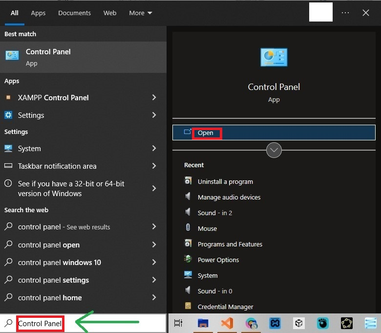
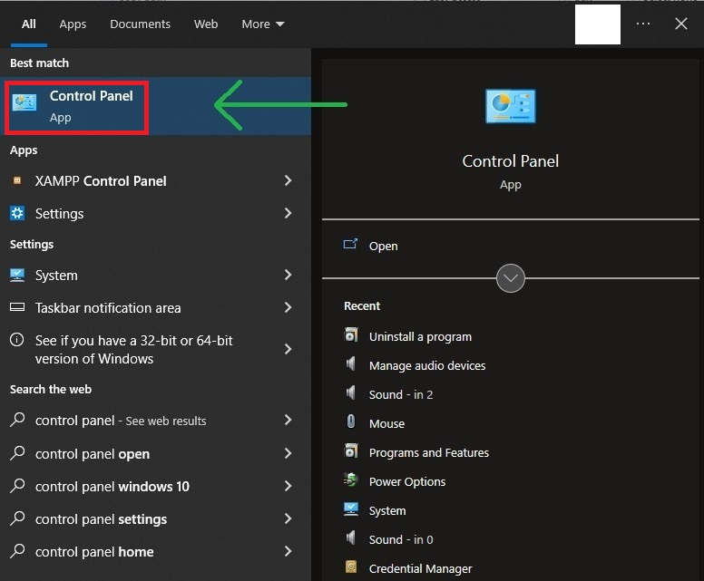
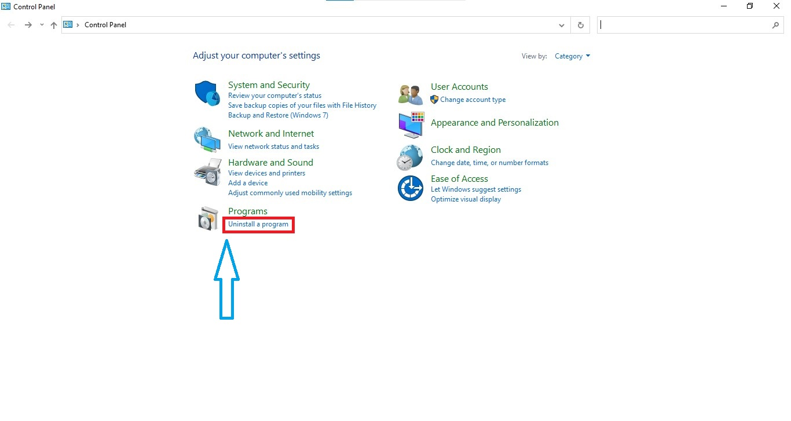
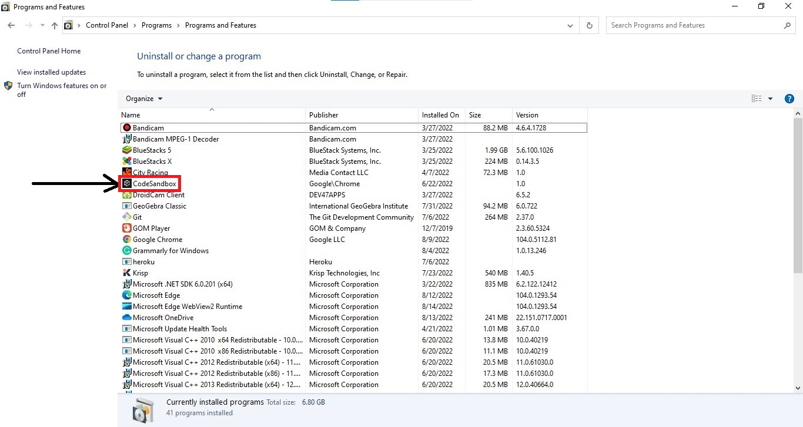
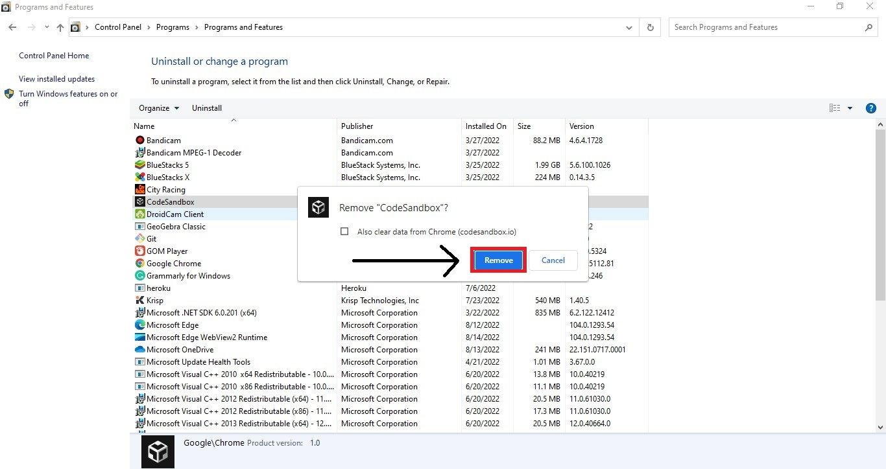

Do you have a software in your laptop or desktop that is making your pc heat up really fast?

Well in this tutorial I will show you how you can uninstall the software or application through the control panel.

### STEP 1: Open the control panel from the windows search bar

* Click on the window key or Move your mouse to the windows icon and click on it
* Search for <code>control panel</code>
* The control panel will be searched
* Click on it to open.

### STEP 2: Click on programs on the "CONTROL PANEL" tab

### STEP 3: Click on "Uninstall a program" under Programs.

### STEP 4: Search for the software you want to uninstall
* If software/application name is not on first screen, stroll down to search for it
* If found, right click on the Software/Application
* Uninstall or Repair will appear, click on Uninstall.

### STEP 5: Click on uninstall from the windows opened
> The uninstall tab is not the same for all softwares

