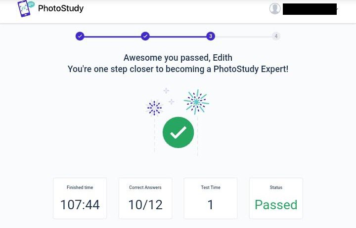

Hello! Welcome to PieLearn. In this blog, I'm going to show you how u can earn thousands of dollars just by solving  and answering questions on Maths, Physics, Chemistry and Biology.

Photostudy is a platform were education is used as a service. This platform allows people all over the world to signup as an expert in any subject they feel most comfortable with.

Photostudy gives experts the opportunity to earn thousand of dollar simply by solving or answering questions.
These questions are posted by students and it's expected by experts to solve these question within a maximum time of 10 minutes except the student options for extra minutes

Well enough of all the introductions, lets get down to the necessary steps required to become a successful expert.
```
Please don't click on the signup link if you have not read the necessary steps.
```
### Step 1

 [Click here](https://expert.photostudy.co/new-expert/232r3m3gegn494hdo) to signup as an expert.

### Step 2 

Signup using a valid facebook account that has been linked  to an email address. If your facebook has not been linked to an email address, follow the link to see how to link your email to facebook.


### Step 3

 After signing up, you will be welcomed to the platform, and you will be required to watch two(2).

### Step 4

Next you will be asked to a answer 30 question about photostudy policies, and the stipulated number of attempts is maximum of 3.

**You can message me in the [Contact](../photostudy-expert/) section where I can assist you in the questions.**

### Step 5

 Ater successfully answering the 30 questions, you will be directed to a page where you can choose a subject of your choice. I will advice you start with a question you are most good at, then you get familiar with the platform.

**Note:** Number of attempts is maximum of 2 for each subject

The number of questions for each subject may varies.
* For maths(algebra) is 23 questions
* For Physics 12 questions
* For geometry 15 questions
* Chemistry 10 questions.

You are expected to pass the test with a minimum of 80%



### Step 6

After successfully answering a subject you optioned for, you be asked to click on the link <code>Go to work</code>, this' your profile will be set and you are fully ready to start working.

<code>Congratulation</code> if you are able to reach this phase. 

.png)

This simply means you can start earning immediately.

Make sure you practice more often to get familiar with a real life problem.
