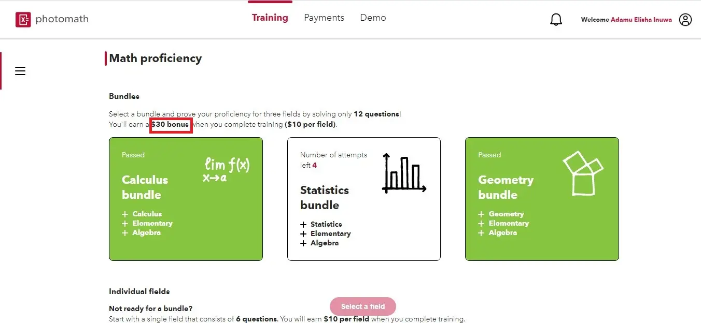

Have you ever wondered how people make lots of money just by working from home? Well the answer is very simple, these people invest their time working as maybe a math expert in one educational website, a tester platform or a freelancer on fiverr.

In this article we are going to learn how to earn money simply by solving maths, physics or testing an application.

## 1. Photostudy

This is a platform where experts who are confident about their field can apply to become an expert and as a return, earn real money.

Experts don't need to live their comfort zone, all you need is a laptop, a stable internet connection, and a brain to think fast.

For more information on how to get started, [follow the link](../photostudy-expert/)

## 2. Photomath

Photomath is a web platform for individuals who are passionate about solving maths questions and earning real money.

Experts in this platform are given maths questions to solve and give detailed steps to how the final answer is reached. 

Experts are required to solve the question using colors, Latex and graphic design tools such as [Figma](https://www.figma.com/).

The screening process is quite simple, you will be asked to solve questions based on your expertise and a timer will be set, so you have to answer the questions as fast as possible.

You will earn $30$ dollars bonus when you finish $3$  of the fields, $10$ dollars for each field.

To get started, [follow the link](https://portal.photomath.net/invite/P6DYNQ/?utm_source=expert referral&utm_medium=platform&utm_campaign=expert referral code)

## 3. Testerwork

Testerwork is a web platform for developers and testers can earn money by finding bugs in a mobile app or website.

Majorly, an app for testing is pre uploaded and testers are required to download the beta version of the app before it is published to the public.

To sign up as a tester, [click on the link](https://testers.testerwork.com/tester-account/sign-up).

**Note: After signing up, you will be asked to answer some questions based on the articles given for you to read**

**Please read it carefully as you will be given a quiz with maximum attempt of two(2)**

Goodluck as you become a tester.